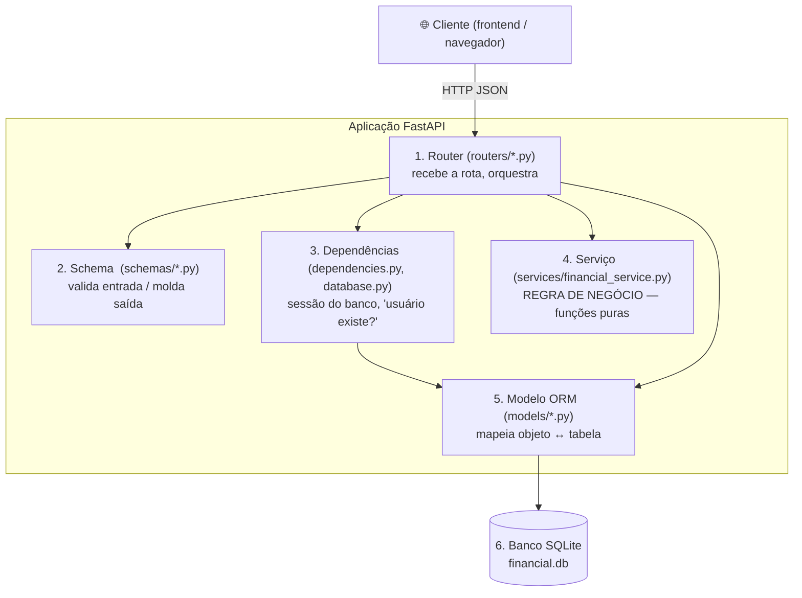
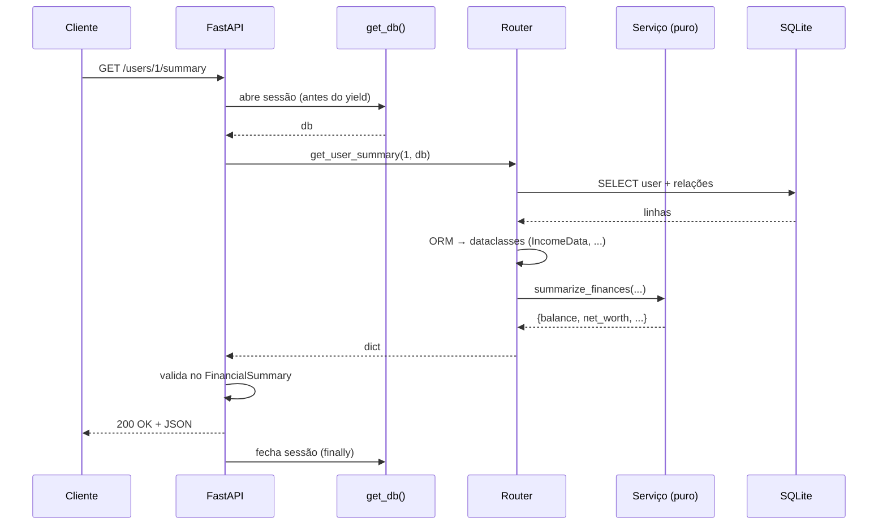
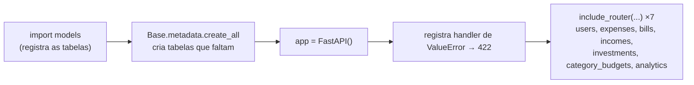
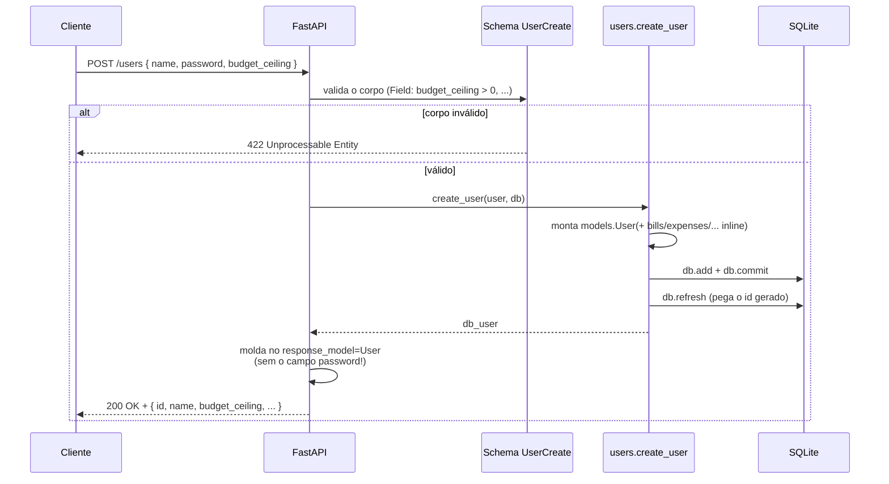
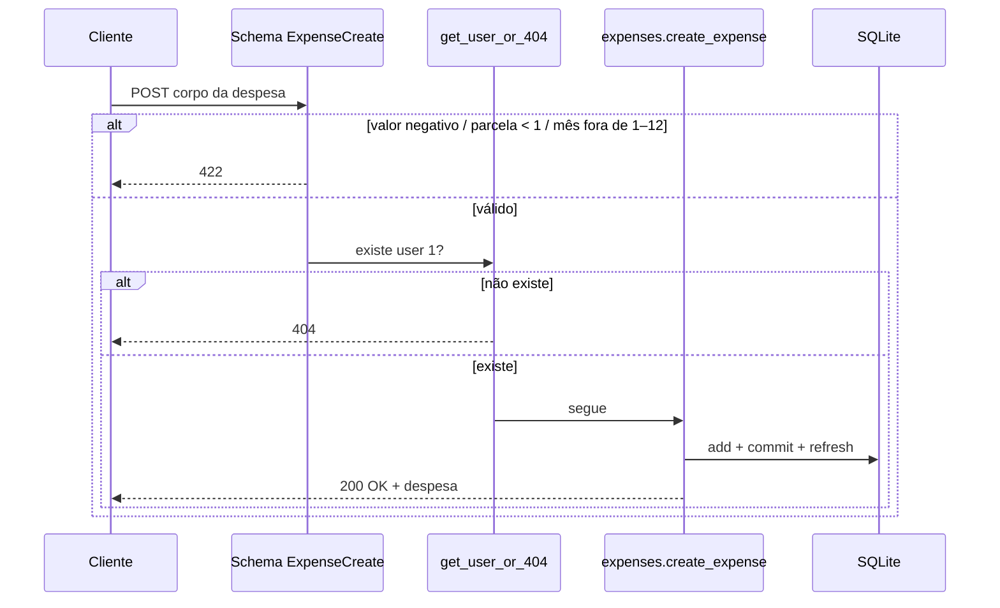
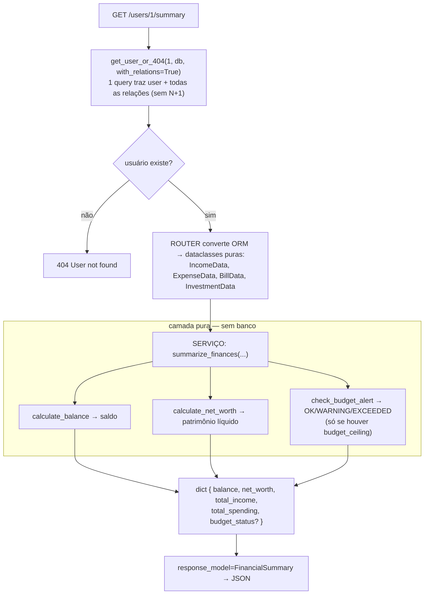
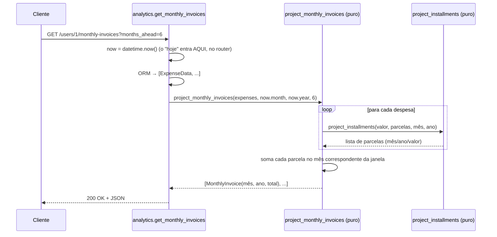
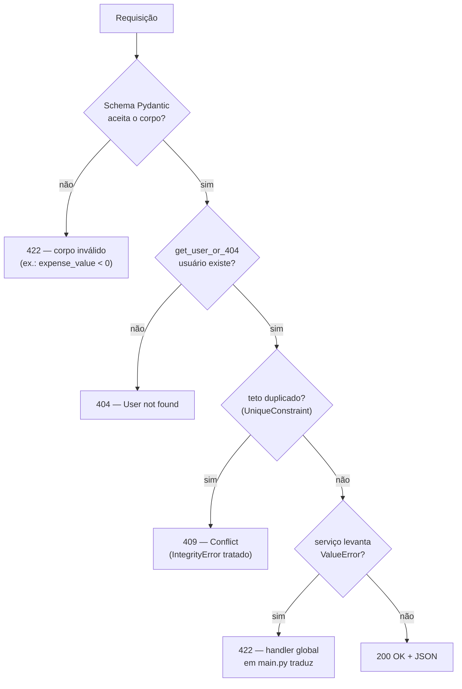
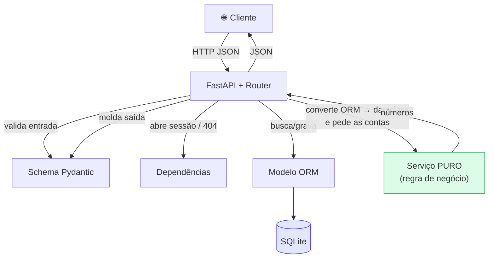

# Fluxo do Backend — Guia Didático

> Documento para **entender e explicar** como o backend funciona, de ponta a ponta.
> Os diagramas usam [Mermaid](https://mermaid.js.org/) (renderizam no GitHub e no VS Code
> com a extensão *Markdown Preview Mermaid*). Os trechos mais importantes também têm uma
> versão em ASCII, que se lê em qualquer lugar.

> Termos do domínio (receita, despesa, parcela, teto, saldo, patrimônio líquido) estão
> explicados no glossário do [`CLAUDE.md`](../CLAUDE.md) e do [`services/CLAUDE.md`](services/CLAUDE.md).

---

## Índice

1. [A ideia em uma frase](#1-a-ideia-em-uma-frase)
2. [As 6 camadas](#2-as-6-camadas)
3. [O ciclo de vida de uma requisição](#3-o-ciclo-de-vida-de-uma-requisição)
4. [Inicialização da aplicação (startup)](#4-inicialização-da-aplicação-startup)
5. [Fluxo de escrita: criar um usuário](#5-fluxo-de-escrita-criar-um-usuário)
6. [Fluxo de escrita: adicionar uma despesa](#6-fluxo-de-escrita-adicionar-uma-despesa)
7. [Fluxo de leitura + cálculo: resumo financeiro](#7-fluxo-de-leitura--cálculo-resumo-financeiro)
8. [Fluxo de composição: faturas mensais](#8-fluxo-de-composição-faturas-mensais)
9. [Como os erros viram respostas HTTP](#9-como-os-erros-viram-respostas-http)
10. [Por que a camada de serviço é "pura"](#10-por-que-a-camada-de-serviço-é-pura)
11. [Mapa mental final](#11-mapa-mental-final)

---

## 1. A ideia em uma frase

> O backend recebe um **pedido HTTP**, **valida** os dados, **busca/grava** no banco e,
> quando precisa de contas, entrega os números para **funções puras** calcularem — e
> devolve um **JSON**.

O ponto central do projeto (objetivo acadêmico) é: **toda regra de negócio vive em funções
puras IO-Free**, separadas do banco e da web. O resto (rotas, banco, validação) é encanamento
em volta dessas funções.

---

## 2. As 6 camadas

Pense no backend como uma cebola: o pedido entra pela borda e vai afundando até o banco,
e a resposta volta pelo caminho inverso.



| # | Camada | Arquivo(s) | Responsabilidade | Analogia |
|---|--------|-----------|------------------|----------|
| 1 | **Router** | `routers/*.py` | Define as URLs e orquestra os passos | O **garçom** que anota e coordena |
| 2 | **Schema** | `schemas/*.py` (Pydantic) | Valida o que entra, formata o que sai | O **conferente** na porta |
| 3 | **Dependências** | `dependencies.py`, `database/database.py` | Abre a sessão do banco; checa se o usuário existe (404) | Os **utensílios** prontos antes de cozinhar |
| 4 | **Serviço** | `services/financial_service.py` | **As contas** (saldo, alertas, projeções) — puro, sem banco | A **calculadora** |
| 5 | **Modelo (ORM)** | `models/*.py` (SQLAlchemy) | Traduz objeto Python ↔ linha da tabela | O **tradutor** |
| 6 | **Banco** | `financial.db` (SQLite) | Guarda os dados | O **depósito** |

**Regra de ouro:** a camada 4 (serviço) **nunca** fala com as camadas 5/6 (banco). Ela só
recebe números e devolve números. Quem busca os dados e entrega para ela é o router.

---

## 3. O ciclo de vida de uma requisição

Todo endpoint segue o mesmo esqueleto. Veja em ASCII primeiro (vale para qualquer rota):

```
   CLIENTE
     │  GET /users/1/summary
     ▼
┌─────────────────────────────────────────────────────────────┐
│ FastAPI                                                       │
│   1. acha a rota certa  ───────────────►  função do router   │
│   2. resolve Depends(get_db) ──────────►  abre sessão do BD   │
│   3. (se há corpo POST) valida no Schema Pydantic  ──► 422?   │
│   4. router chama get_user_or_404 ─────►  não existe? → 404   │
│   5. router lê dados do ORM e monta dataclasses puras         │
│   6. router chama a função de SERVIÇO (puro) ──► faz as contas│
│   7. retorna; FastAPI molda no response_model ──► vira JSON   │
│   8. finally: fecha a sessão do BD                            │
└─────────────────────────────────────────────────────────────┘
     │  200 OK + JSON
     ▼
   CLIENTE
```

A sessão do banco (`get_db`) é o detalhe mais elegante: ela é um **gerador** (`yield`).
O FastAPI executa o código **antes** do `yield` para abrir a conexão, entrega ao endpoint,
e depois executa o **`finally`** para fechar — sempre, mesmo se der erro.



---

## 4. Inicialização da aplicação (startup)

Antes de atender qualquer requisição, o `main.py` monta o app. É curto e faz 4 coisas:



Pontos para explicar:

- **`import models`** parece inútil, mas é essencial: importar os modelos faz o SQLAlchemy
  "tomar conhecimento" das tabelas, para o `create_all` conseguir criá-las.
- **`create_all`** só cria tabelas que **ainda não existem** — ele não altera tabelas já
  criadas. (Por isso, ao mudar um modelo, é preciso apagar o `financial.db`.)
- **`include_router`** é o que pluga cada grupo de rotas no app. Cada router tem um `prefix`
  (ex.: `/users/{user_id}/expenses`), então a URL final é `prefix + caminho`.

---

## 5. Fluxo de escrita: criar um usuário

`POST /users` — cria o usuário e (opcionalmente) já recebe listas de contas/despesas/etc.
"inline". É um fluxo de **escrita**: valida → grava → devolve.



Detalhes didáticos:

- **`UserCreate` × `User`**: há dois schemas. `UserCreate` é a **entrada** (tem `password`);
  `User` é a **saída** (herda de `UserBase`, que **não** tem `password`). Por isso a senha
  entra mas nunca volta na resposta.
- **`db.refresh(db_user)`**: depois do `commit`, o banco gerou o `id`. O `refresh` recarrega
  o objeto para a resposta já sair com o `id` preenchido.
- **`cascade`**: como `User` tem relações com `cascade="all, delete-orphan"`, ao gravar o
  usuário com listas inline, os filhos (bills, expenses…) são gravados juntos.

---

## 6. Fluxo de escrita: adicionar uma despesa

`POST /users/{id}/expenses` — representa o padrão de **toda entidade** (bills, incomes,
investments, category-budgets seguem o mesmo molde). Duas barreiras de proteção: validação
de schema e checagem de usuário.

```
POST /users/1/expenses { name, expense_value, installment, ... }
        │
        ▼
[ Schema ExpenseCreate ]  expense_value ≥ 0 ? installment ≥ 1 ? mês 1..12 ?
        │ inválido → 422
        ▼ válido
[ get_user_or_404(1, db) ]  usuário existe?
        │ não → 404
        ▼ sim
[ models.Expense(**dados, user_id=1) ]
        │  db.add → db.commit → db.refresh
        ▼
[ response_model=Expense ]  → 200 OK + JSON da despesa criada
```



> **Por que validar duas vezes (schema *e* serviço)?** O schema barra dados ruins **na
> escrita** (422 imediato, antes de gravar). O serviço valida de novo **na leitura/cálculo**
> como rede de segurança para dados que por acaso já estejam no banco. É defesa em profundidade.

---

## 7. Fluxo de leitura + cálculo: resumo financeiro

`GET /users/{id}/summary` é o coração do projeto: mostra como o router **busca dados** e
**delega as contas** para a camada de serviço pura.



A "tradução" ORM → dataclass é o que mantém o serviço desacoplado do banco:

```
  Objeto ORM (vem do banco)            Dataclass pura (entra no serviço)
  ┌─────────────────────────┐         ┌──────────────────────────┐
  │ Expense                  │         │ ExpenseData              │
  │   id, name, user_id ...  │  ───►   │   expense_value          │
  │   expense_value          │ (router │   installment            │
  │   installment, category  │  monta) │   start_month, start_year│
  │   start_month/year       │         │   category               │
  └─────────────────────────┘         └──────────────────────────┘
        (sabe de banco)                     (não sabe de banco)
```

O serviço recebe só `ExpenseData` — não tem `id`, nem `user_id`, nem conexão. Ele **não tem
como** tocar no banco. Isso é proposital.

---

## 8. Fluxo de composição: faturas mensais

`GET /users/{id}/monthly-invoices` mostra **composição**: uma função de serviço reaproveita
outra já testada.



Dois conceitos didáticos importantes aqui:

1. **O "hoje" entra pelo router, não pelo serviço.** O serviço recebe `reference_month/year`
   como parâmetro. Quem lê o relógio (`datetime.now()`) é o router. Assim o serviço é
   **determinístico**: mesmas entradas → mesmas saídas → fácil de testar.
2. **Composição:** `project_monthly_invoices` não reimplementa o cálculo de parcelas — ela
   **chama** `project_installments` para cada despesa e só agrega os resultados por mês.
   Menos código, e herda toda a lógica já testada (virada de ano, arredondamento).

---

## 9. Como os erros viram respostas HTTP

O backend tem 3 caminhos de erro, cada um com um código HTTP claro:



| Código | Quando acontece | Onde é decidido |
|--------|-----------------|-----------------|
| **422** | Corpo não passa nas constraints do Pydantic (`Field(ge=0)`, etc.) | Schemas (`schemas/*.py`) |
| **404** | Usuário não existe | `dependencies.get_user_or_404` |
| **409** | Cria um 2º teto para a mesma categoria | `routers/category_budgets.py` (captura `IntegrityError`) |
| **422** | Uma regra de negócio levanta `ValueError` (dados legados) | Handler global em `main.py` |

O handler global em `main.py` é a rede de segurança: qualquer `ValueError` que escape da
camada de serviço vira **422** em vez de estourar um **500**.

---

## 10. Por que a camada de serviço é "pura"

"Função pura (IO-Free)" = só depende dos argumentos e só devolve um valor. **Não** lê banco,
arquivo, rede nem relógio.

```
   ENTRADA (números)                 SAÍDA (números)
   ────────────────►  [ função ]  ────────────────►
   sem efeitos colaterais, sem estado escondido
```

Por que isso importa tanto neste projeto:

- **Testável sem mocks:** para testar `calculate_balance`, basta passar listas e conferir o
  número. Não precisa subir banco nem simular nada. (Por isso há ~85 testes unitários rápidos.)
- **Determinística:** mesma entrada → mesma saída, sempre. Não "quebra na virada da meia-noite"
  porque o `datetime.now()` mora no router, não na função.
- **Fácil de raciocinar:** a regra de negócio fica isolada, sem o ruído de SQL e HTTP em volta.

```
  ┌──────────────┐   números    ┌───────────────────────┐   números   ┌──────────────┐
  │   ROUTER     │ ───────────► │   SERVIÇO (puro)       │ ──────────► │   ROUTER     │
  │ (faz I/O:    │              │  calculate_balance      │             │ (devolve     │
  │  banco, web, │              │  check_budget_alert     │             │  JSON)       │
  │  relógio)    │ ◄─────────── │  project_installments   │             │              │
  └──────────────┘   resultado  └───────────────────────┘             └──────────────┘
       SUJO                              LIMPO                              SUJO
```

A fronteira é clara: **tudo que é "sujo" (I/O) fica nas pontas (router/banco); o miolo
(regra de negócio) é limpo.**

---

## 11. Mapa mental final



**Para explicar o backend em 30 segundos:**

> "Cada rota é um **router** que: (1) deixa o **Pydantic validar** a entrada, (2) usa uma
> **dependência** para abrir o banco e checar se o usuário existe, (3) **busca os dados** via
> **ORM**, (4) converte esses dados em **dataclasses puras** e entrega para a **camada de
> serviço** fazer as **contas** (que não sabe nada de banco), e (5) devolve o resultado como
> **JSON** moldado por um schema de saída. Erros viram 404/409/422 de forma previsível."

---

### Onde cada coisa mora (resumo de arquivos)

| Quero entender... | Olhe em... |
|-------------------|-----------|
| Quais rotas existem | `routers/*.py` + `main.py` |
| O que cada rota valida/retorna | `schemas/*.py` |
| Como o banco é configurado | `database/database.py` |
| Checagem de "usuário existe" | `dependencies.py` |
| **As regras de negócio (as contas)** | `services/financial_service.py` |
| Estrutura das tabelas | `models/*.py` |
| Detalhe profundo da camada de serviço | `services/CLAUDE.md` |
| Visão geral do projeto | `../CLAUDE.md` |
