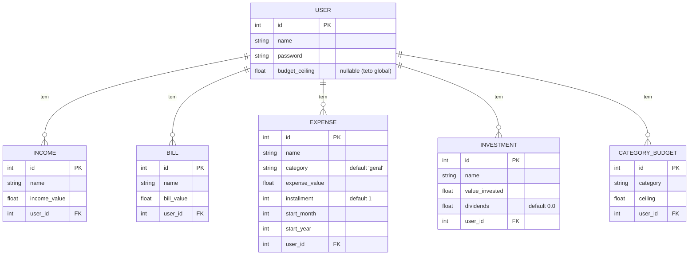
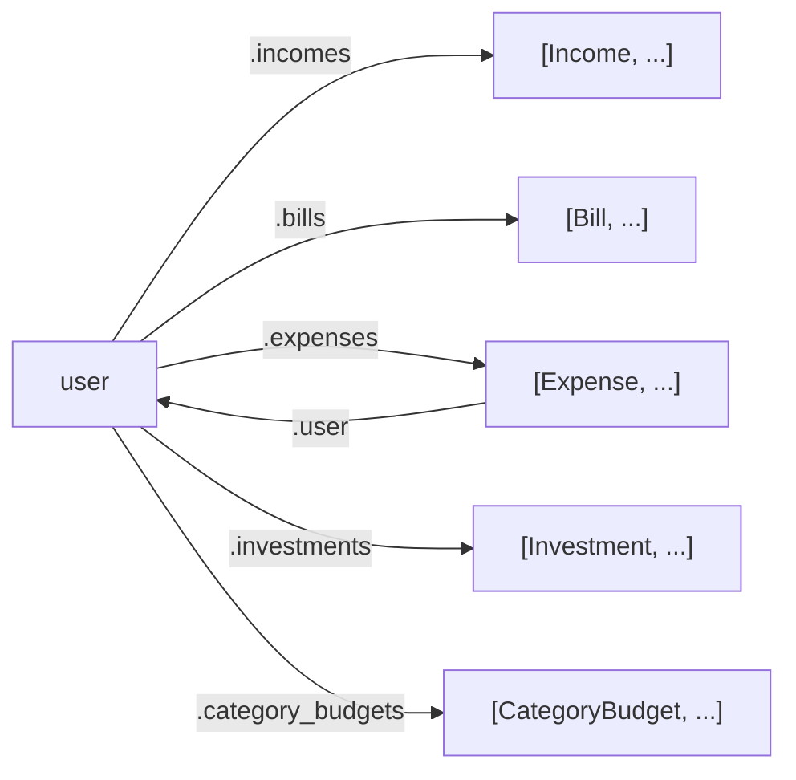
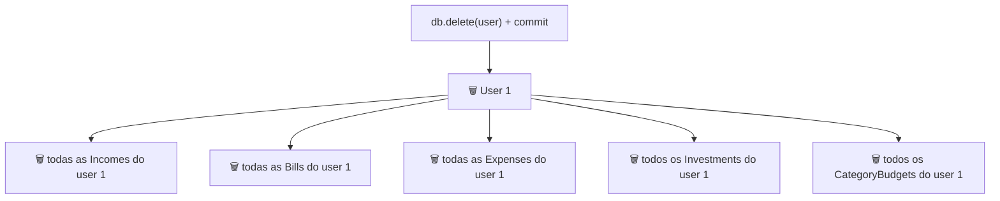

# Relacionamentos do Banco de Dados — Guia Didático

> Como as tabelas se ligam umas às outras. Os diagramas usam [Mermaid](https://mermaid.js.org/)
> (renderiza no GitHub e no VS Code); os pontos principais também têm versão em ASCII.
> Termos do domínio estão no glossário do [`CLAUDE.md`](../CLAUDE.md).

---

## Índice

1. [A ideia em uma frase](#1-a-ideia-em-uma-frase)
2. [Diagrama de entidades (ER)](#2-diagrama-de-entidades-er)
3. [Os conceitos por trás (PK, FK, 1:N, cascade…)](#3-os-conceitos-por-trás)
4. [Cada relação em detalhe](#4-cada-relação-em-detalhe)
5. [Como isso aparece nas tabelas](#5-como-isso-aparece-nas-tabelas)
6. [Como navegar pelas relações no código](#6-como-navegar-pelas-relações-no-código)
7. [Deleção em cascata na prática](#7-deleção-em-cascata-na-prática)
8. [Resumo](#8-resumo)

---

## 1. A ideia em uma frase

> Existe **uma entidade central — o `User`** — e **cinco entidades-filhas** que pertencem a
> ele. Toda ligação do banco passa pelo usuário; as filhas **não se conhecem** entre si.

É um formato de **estrela** (hub-and-spoke): o usuário no meio, as filhas em volta.

```
                    ┌───────────┐
                    │  Income   │  (receitas)
                    └─────┬─────┘
   ┌───────────┐         │           ┌──────────────┐
   │   Bill    │─────┐   │   ┌───────│ Investment   │
   │(contas fix)│     │   │   │       │(investimentos)│
   └───────────┘     ▼   ▼   ▼       └──────────────┘
                    ┌───────────────┐
                    │     USER      │   ◄── centro de tudo
                    │  (usuário)    │
                    └───────────────┘
                       ▲          ▲
              ┌────────┘          └─────────┐
       ┌──────────────┐           ┌───────────────────┐
       │   Expense    │           │  CategoryBudget   │
       │  (despesas)  │           │ (teto por categoria)│
       └──────────────┘           └───────────────────┘
```

Cada filha guarda **de quem ela é** através de um campo `user_id`. Um usuário pode ter
**muitas** de cada (muitas despesas, muitas receitas…); cada filha pertence a **um** usuário.
Isso se chama relação **um-para-muitos** (1:N).

---

## 2. Diagrama de entidades (ER)



A notação `||--o{` quer dizer: **um** usuário (`||`) para **zero ou muitos** (`o{`) filhos.
Ou seja, um usuário pode existir sem nenhuma despesa, ou ter várias.

> `CATEGORY_BUDGET` tem ainda uma regra extra: a combinação **(`user_id`, `category`) é única**
> — um usuário não pode ter dois tetos para a mesma categoria. (Veja a seção 3.)

---

## 3. Os conceitos por trás

Cinco conceitos explicam **todo** o esquema:

### 3.1 PK — Chave primária (`Primary Key`)
O identificador único de cada linha. Toda tabela tem `id = Column(Integer, primary_key=True)`.
É como o "número de matrícula" da linha: nunca se repete dentro da tabela.

### 3.2 FK — Chave estrangeira (`Foreign Key`)
O campo que **aponta para o `id` de outra tabela**. Nas filhas:

```python
user_id = Column(Integer, ForeignKey("users.id"), nullable=False)
```

Isso diz: *"este `user_id` tem que ser o `id` de um usuário que existe"*. É o **fio** que
liga a filha ao dono.

- `nullable=False` → **toda filha obrigatoriamente tem um dono**. Não existe despesa órfã.

```
   EXPENSE.user_id  ───aponta para───►  USER.id
       (FK)                               (PK)
```

### 3.3 Um-para-muitos (1:N)
Um lado tem **um** (o usuário), o outro tem **muitos** (as despesas). Quem carrega a FK é
sempre o lado "muitos" (a filha guarda o `user_id`, não o contrário).

### 3.4 `relationship` + `back_populates` — a relação nos dois sentidos
A FK é o fio no banco. No **código**, o SQLAlchemy oferece uma forma cômoda de andar pelo
fio nos dois sentidos, sem escrever SQL:

```python
# em User:     pega a LISTA de despesas do usuário
expenses = relationship("Expense", back_populates="user", cascade="all, delete-orphan")

# em Expense:  pega o DONO daquela despesa
user = relationship("User", back_populates="expenses")
```

- `user.expenses` → lista de `Expense` (sentido 1 → muitos)
- `expense.user` → o `User` dono (sentido muitos → 1)

O `back_populates` **liga os dois lados**: se você adicionar uma despesa em `user.expenses`,
o `expense.user` daquela despesa já aponta para o usuário, automaticamente. São dois espelhos
da mesma relação.

### 3.5 `cascade="all, delete-orphan"` — deleção em cascata
Define o que acontece com as filhas quando mexem no pai:

- Apagou o usuário → **todas as filhas dele são apagadas junto** (`all` inclui `delete`).
- Tirou uma filha da lista do usuário (virou "órfã") → a filha é apagada (`delete-orphan`).

Sem isso, apagar um usuário deixaria despesas/contas soltas apontando para um dono que não
existe mais. (Veja a seção 7.)

### 3.6 `UniqueConstraint` — regra de unicidade (só em `CategoryBudget`)
```python
__table_args__ = (UniqueConstraint("user_id", "category"),)
```
Garante que **o par (usuário, categoria) não se repete**. O usuário 1 só pode ter **um** teto
para "alimentação". Tentar criar um segundo → o banco recusa, e o backend responde **409 Conflict**.

---

## 4. Cada relação em detalhe

Todas as cinco relações são **idênticas em forma** (User 1 : N filha). Muda só a filha:

| Lado "um" | Lado "muitos" | Tabela | FK na filha | Cascade? | Regra extra |
|-----------|---------------|--------|-------------|----------|-------------|
| `User` | `Income` (receitas) | `incomes` | `user_id` NOT NULL | sim | — |
| `User` | `Bill` (contas fixas) | `bills` | `user_id` NOT NULL | sim | — |
| `User` | `Expense` (despesas) | `expenses` | `user_id` NOT NULL | sim | — |
| `User` | `Investment` (investimentos) | `investments` | `user_id` NOT NULL | sim | — |
| `User` | `CategoryBudget` (tetos por categoria) | `category_budgets` | `user_id` NOT NULL | sim | **único (user_id, category)** |

**O que NÃO existe (de propósito):**
- Nenhuma relação **entre as filhas**. Uma `Expense` não conhece um `CategoryBudget`
  diretamente. A ligação entre uma despesa e o teto da categoria dela acontece **na camada de
  serviço** (comparando o campo `category` das duas), não por chave estrangeira.
- Nenhuma relação muitos-para-muitos. Tudo é 1:N a partir do usuário.

---

## 5. Como isso aparece nas tabelas

Concretamente, a FK é só um número que se repete apontando para o `id` do dono:

```
TABELA users
┌────┬─────────┬──────────────────┐
│ id │ name    │ budget_ceiling   │
├────┼─────────┼──────────────────┤
│ 1  │ Arthur  │ 2000.0           │   ◄── o id 1...
│ 2  │ Maria   │ NULL             │
└────┴─────────┴──────────────────┘

TABELA expenses
┌────┬───────────┬───────────────┬─────────┐
│ id │ name      │ expense_value │ user_id │
├────┼───────────┼───────────────┼─────────┤
│ 10 │ Notebook  │ 3000.0        │  1  ◄───┼─── ...é referenciado aqui (são do Arthur)
│ 11 │ Mercado   │ 300.0         │  1  ◄───┤
│ 12 │ Livro     │ 80.0          │  2      │   (este é da Maria)
└────┴───────────┴───────────────┴─────────┘
```

Para "achar as despesas do Arthur", o banco faz:
`SELECT * FROM expenses WHERE user_id = 1` → linhas 10 e 11.

É exatamente isso que o router faz (via ORM) em `list_expenses`:
```python
db.query(models.Expense).filter(models.Expense.user_id == user_id).all()
```

---

## 6. Como navegar pelas relações no código

Graças ao `relationship`, você anda pelos fios como se fossem atributos normais — **sem SQL**:

```python
user = db.query(User).first()

# 1 → muitos: do usuário para as filhas
user.expenses        # [Expense(10), Expense(11)]   (lista)
user.incomes         # [Income(...), ...]
user.category_budgets

# muitos → 1: da filha para o dono
expense = user.expenses[0]
expense.user         # o User dono (volta para o Arthur)
expense.user.name    # "Arthur"
```

É isso que o endpoint de resumo aproveita: com **uma** consulta que já traz as relações
(`get_user_or_404(..., with_relations=True)`), ele lê `user.incomes`, `user.expenses`,
`user.bills`, `user.investments` e entrega tudo para a camada de serviço.



---

## 7. Deleção em cascata na prática

Por causa do `cascade="all, delete-orphan"`, apagar o usuário limpa tudo que é dele:



Em ASCII, a regra:

```
   apaga User 1
        │
        ├─► apaga Income  WHERE user_id = 1
        ├─► apaga Bill    WHERE user_id = 1
        ├─► apaga Expense WHERE user_id = 1
        ├─► apaga Investment ...
        └─► apaga CategoryBudget ...
```

Sem o cascade, o banco recusaria apagar o usuário (porque há filhas apontando para ele com
FK `NOT NULL`), ou deixaria filhas órfãs. O cascade resolve isso automaticamente: o usuário e
todo o seu "patrimônio de dados" somem juntos, de forma consistente.

---

## 8. Resumo

- **Um hub (`User`) e cinco spokes** (Income, Bill, Expense, Investment, CategoryBudget).
- Toda relação é **1:N** (um usuário, muitas filhas), com a **FK `user_id` na filha**, sempre
  **`NOT NULL`** (não há filha sem dono).
- `relationship` + `back_populates` deixam navegar nos **dois sentidos** no código
  (`user.expenses` ↔ `expense.user`), sem escrever SQL.
- `cascade="all, delete-orphan"`: apagar o usuário **apaga todas as filhas**.
- `CategoryBudget` tem a regra extra **(user_id, category) único** → POST duplicado dá **409**.
- **As filhas não se ligam entre si**; qualquer cruzamento (ex.: despesa × teto da categoria)
  é feito na **camada de serviço**, comparando o campo `category`.

### Onde está cada coisa

| Quero ver... | Arquivo |
|--------------|---------|
| Definição do hub e das relações | `models/user.py` |
| Cada filha (campos + FK + relationship) | `models/{bill,expense,income,investment,category_budget}.py` |
| A regra de unicidade do teto | `models/category_budget.py` |
| Como as relações são consultadas | `routers/*.py` (ex.: `get_user_or_404(..., with_relations=True)`) |
| Visão geral dos modelos | [`../CLAUDE.md`](../CLAUDE.md) (seção *Modelos*) |
