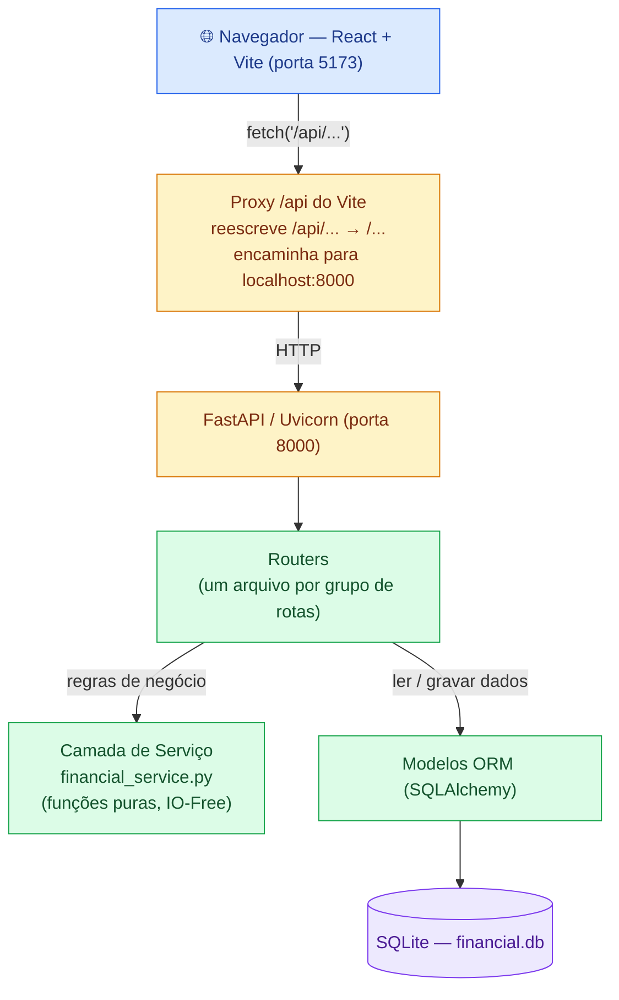
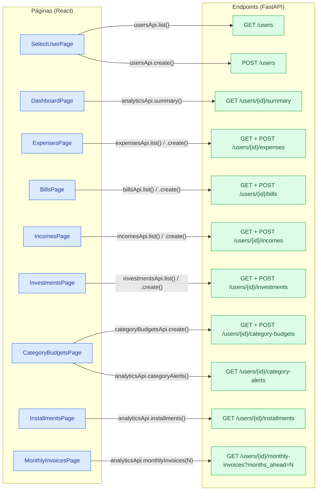
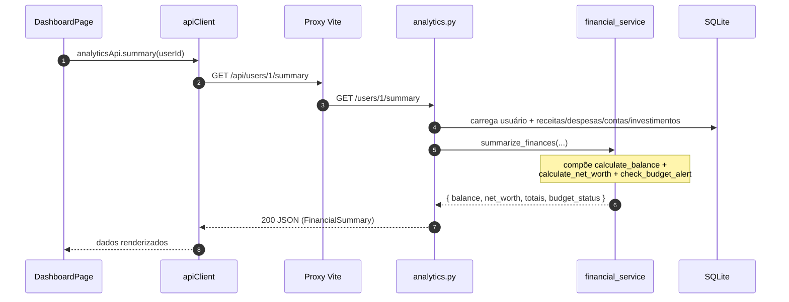
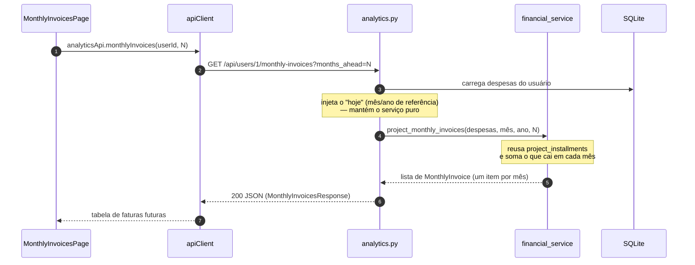
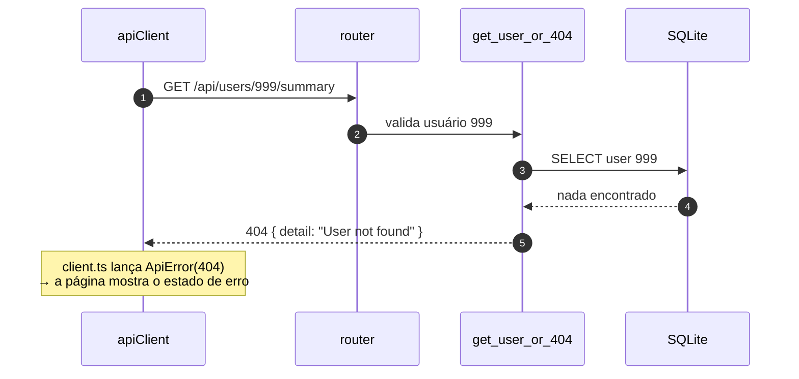
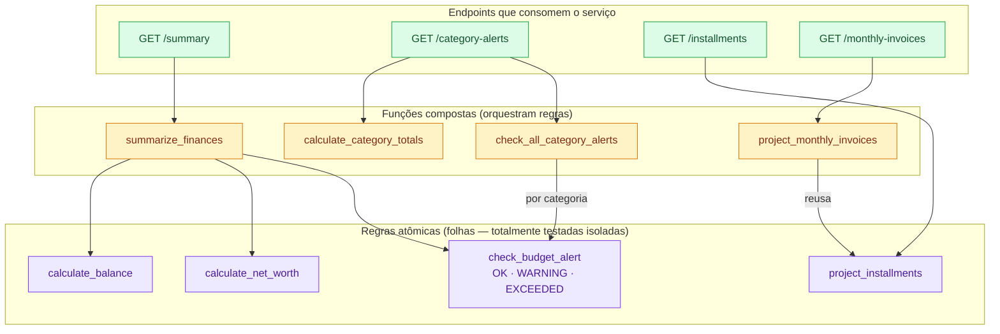

# Arquitetura — Expense Tracker

Documento visual da arquitetura. Todos os diagramas usam **nomes legíveis nos nós**
(sem letras soltas tipo `C`/`B`), pra você não precisar voltar pra cima toda hora pra
lembrar o que cada caixinha significa.

> Os blocos abaixo são [Mermaid](https://mermaid.js.org). O VSCode renderiza com a
> extensão *Markdown Preview Mermaid Support*; o GitHub renderiza nativamente.

---

## 1. Visão em camadas (o caminho de uma requisição)

**Como ler:** o frontend nunca fala `localhost:8000` direto. Ele chama caminhos
relativos `/api/...` (ver `frontend/src/api/client.ts`, `BASE_URL = '/api'`). O proxy do
Vite (`frontend/vite.config.ts`) tira o prefixo `/api` e repassa pro backend. Por isso em
produção basta servir os dois sob o mesmo domínio — o código do frontend não muda.

---

## 2. Mapa completo: cada página → cada chamada → cada endpoint

Cada página do frontend usa um *módulo de API* (`frontend/src/api/*.ts`), que chama o
`apiClient`, que vira uma requisição HTTP num router do backend.

### Mesma informação em tabela (pra consulta rápida)

| Página | Função de API (`frontend/src/api`) | Método + Rota | Router (backend) | Usa serviço? |
|--------|------------------------------------|---------------|------------------|--------------|
| SelectUserPage | `usersApi.list()` | `GET /users` | `users.py` | — |
| SelectUserPage | `usersApi.create()` | `POST /users` | `users.py` | — |
| DashboardPage | `analyticsApi.summary()` | `GET /users/{id}/summary` | `analytics.py` | ✅ `summarize_finances` |
| ExpensesPage | `expensesApi.list/create()` | `GET·POST /users/{id}/expenses` | `expenses.py` | — (CRUD) |
| BillsPage | `billsApi.list/create()` | `GET·POST /users/{id}/bills` | `bills.py` | — (CRUD) |
| IncomesPage | `incomesApi.list/create()` | `GET·POST /users/{id}/incomes` | `incomes.py` | — (CRUD) |
| InvestmentsPage | `investmentsApi.list/create()` | `GET·POST /users/{id}/investments` | `investments.py` | — (CRUD) |
| CategoryBudgetsPage | `categoryBudgetsApi.create()` | `POST /users/{id}/category-budgets` | `category_budgets.py` | — (CRUD + 409) |
| CategoryBudgetsPage | `analyticsApi.categoryAlerts()` | `GET /users/{id}/category-alerts` | `analytics.py` | ✅ `check_all_category_alerts` |
| InstallmentsPage | `analyticsApi.installments()` | `GET /users/{id}/installments` | `analytics.py` | ✅ `project_installments` |
| MonthlyInvoicesPage | `analyticsApi.monthlyInvoices(N)` | `GET /users/{id}/monthly-invoices` | `analytics.py` | ✅ `project_monthly_invoices` |

> A função `usersApi.get(id)` também existe (`frontend/src/api/users.ts`) e é usada para
> recarregar o usuário selecionado no `UserContext`, não a partir de uma página específica.

---

## 3. Sequência detalhada das chamadas "interessantes" (analytics)

Os endpoints de CRUD são diretos (recebe → grava/lê → responde). Os de *analytics* são os
que valem um diagrama de sequência, porque é onde a camada de serviço entra.

### 3.1 Dashboard — resumo financeiro

### 3.2 Faturas mensais (projeção consolidada)

### 3.3 Caminho de erro (404 — usuário inexistente)

Vale para **qualquer** rota `/users/{id}/...`: o helper `get_user_or_404`
(`app/dependencies.py`) roda antes da lógica.

---

## 4. Camada de serviço — como as regras se compõem

Esta é a parte mais importante do projeto (todas as regras de negócio vivem aqui, em
funções **puras / IO-Free**). Em vez de descrever em texto, o melhor formato é um grafo de
**composição**: quais funções são "folhas" (regra atômica) e quais **reusam** as outras.

**Por que esse formato ajuda nos testes (objetivo acadêmico do projeto):**

- As **folhas** (roxo) são funções puras pequenas — testadas com unit tests e técnicas de
  cobertura (ex.: `check_budget_alert` tem MC/DC completo nos limites 80% e 100%).
- As **compostas** (amarelo) não reimplementam regra: elas *reusam* as folhas. Então o
  teste delas foca na orquestração, não em recalcular tudo.
- Os **endpoints** (verde) só fazem IO (ler banco, injetar "hoje") e delegam — por isso a
  regra continua testável sem banco e sem mocks.

### Resumo das funções

| Função | Papel | Compõe / reusa |
|--------|-------|----------------|
| `calculate_balance` | saldo = Σ receitas − Σ parcela mensal − Σ contas fixas | folha |
| `check_budget_alert` | classifica gasto vs. teto em OK/WARNING/EXCEEDED | folha |
| `project_installments` | distribui a compra em parcelas mensais (última absorve arredondamento) | folha |
| `calculate_net_worth` | patrimônio = saldo + Σ (investido + dividendos) | folha |
| `calculate_category_totals` | agrupa custo mensal por categoria | folha |
| `summarize_finances` | monta o resumo do dashboard | balance + net_worth + budget |
| `check_all_category_alerts` | aplica o alerta a cada categoria com teto | budget (por categoria) |
| `project_monthly_invoices` | consolida parcelas de todas as despesas por mês | installments |

---

## Referência rápida de arquivos

| Camada | Onde |
|--------|------|
| Cliente HTTP do front | `frontend/src/api/client.ts` |
| Módulos de API | `frontend/src/api/{users,entities,analytics}.ts` |
| Proxy de dev | `frontend/vite.config.ts` |
| Entrypoint backend | `app/main.py` |
| Rotas | `app/routers/*.py` |
| Regras de negócio | `app/services/financial_service.py` (+ `services/CLAUDE.md`) |
| Modelos ORM | `app/models/*.py` |
| Guarda 404 | `app/dependencies.py` |
